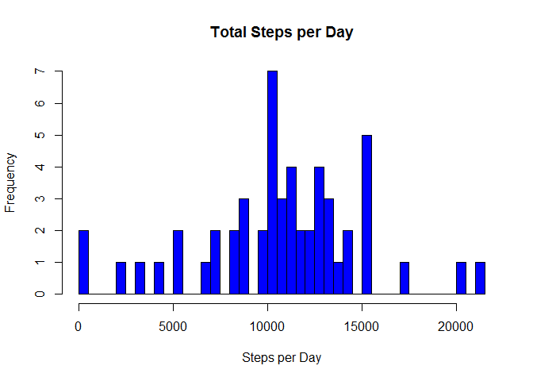
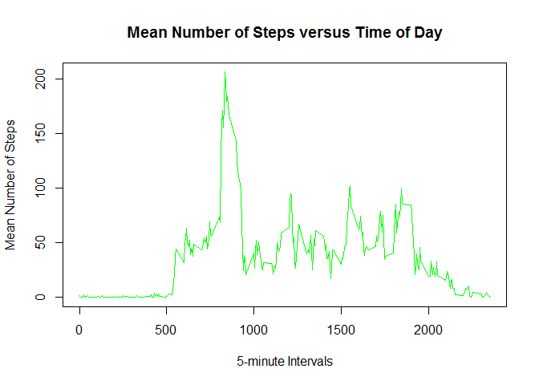
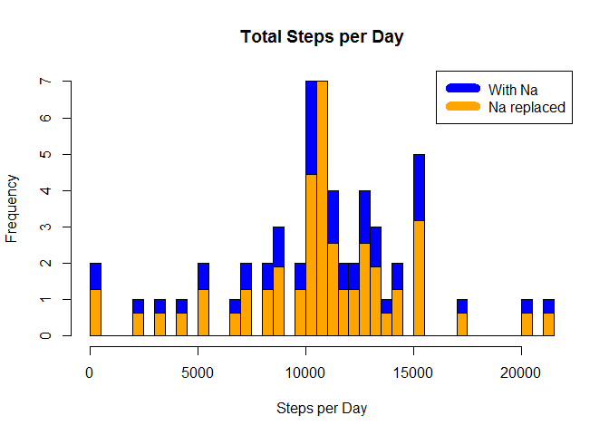

# Activity Patterns
#**Reproducible Research Project 1**

##Introduction
It is now possible to collect a large amount of data about personal movement using activity monitoring devices such as a Fitbit, Nike Fuelband, or Jawbone Up. These type of devices are part of the "quantified self" movement - a group of enthusiasts who take measurements about themselves regularly to improve their health, to find patterns in their behavior, or because they are tech geeks. But these data remain under-utilized both because the raw data are hard to obtain and there is a lack of statistical methods and software for processing and interpreting the data.

This assignment makes use of data from a personal activity monitoring device. This device collects data at 5 minute intervals through out the day. The data consists of two months of data from an anonymous individual collected during the months of October and November, 2012 and include the number of steps taken in 5 minute intervals each day.

##Loading and preprocessing the data

```r
library(dplyr)
```

```
## Warning: package 'dplyr' was built under R version 3.3.3
```

```
## 
## Attaching package: 'dplyr'
```

```
## The following objects are masked from 'package:stats':
## 
##     filter, lag
```

```
## The following objects are masked from 'package:base':
## 
##     intersect, setdiff, setequal, union
```

```r
library(ggplot2)
```

```
## Warning: package 'ggplot2' was built under R version 3.3.3
```

```r
library(knitr)
activity <- read.csv("activity.csv", stringsAsFactors = FALSE)
```
##What is mean total number of steps taken per day?

```r
##calculate the total number of steps per day
stepsperday <- aggregate(steps ~ date, data = activity, FUN = sum, na.rm = TRUE)

hist(stepsperday$steps,
     main = "Total Steps per Day",
     xlab = "Steps per Day",
     col = "blue",
     breaks = 50
     )
```

<!-- -->

##Mean and Median Steps


```r
mean_steps <- mean(stepsperday$steps)
mean_steps
```

```
## [1] 10766.19
```

```r
median_steps <- median(stepsperday$steps)
median_steps
```

```
## [1] 10765
```

##What is the average daily activity pattern?

```r
##calculate mean of steps for each interval per day
mean_interval <- aggregate(steps ~ interval, data = activity, FUN = mean, na.rm = TRUE)

plot(x = mean_interval$interval, 
    y = mean_interval$steps, 
    main = "Mean Number of Steps versus Time of Day",
    type = "l", 
    col = "green",
    xlab = "5-minute Intervals",
    ylab = "Mean Number of Steps"
    )
```

<!-- -->

```r
##Which 5-minute interval, on average across all the days in the dataset, contains the maximum number of steps
maxsteps <- mean_interval$interval[which.max(mean_interval$steps)]
maxsteps
```

```
## [1] 835
```


```r
##calculate number of missing data points
missing_values <- sum(is.na(activity$steps))
missing_values
```

```
## [1] 2304
```
##Assigning missing values the average value across the data set for that time interval

```r
activity_noNa <- activity
for(i in 1:nrow(activity_noNa)){
  if(is.na(activity_noNa$steps[i])){##checks if a value is NA
    interval_count <- activity_noNa$interval[i]##gets the interval at where value is NA
    step_count <- which(mean_interval$interval == interval_count)##get the row number for that interval in the data set that calculated
                                                                 ##the means of each interval for the entire data set
    activity_noNa$steps[i] <- round(mean_interval$steps[step_count])##replace the NA value with the mean of that interval 
                                                                    ##the value is rounded since one cannot do a partial step
  }
}
```
##Are there differences in activity patterns between weekdays and weekends?

```r
stepsperday_new <- aggregate(steps ~ date, data = activity_noNa, FUN = sum)##calculate total number of steps per day for new data set

hist(stepsperday$steps,
     main = "Total Steps per Day",
     xlab = "Steps per Day",
     col = "blue",
     breaks = 50)
par(new=TRUE)##add the second histogram
hist(stepsperday_new$steps,
     col = "orange", axes = FALSE, 
     xlab = '', ylab = '', main = '',
     breaks = 50)
legend("topright", c("With Na", "Na replaced"), col=c("blue", "orange"), lwd=10)
```

<!-- -->

```r
mean_steps_noNA <- mean(stepsperday_new$steps)
mean_steps_noNA
```

```
## [1] 10765.64
```

```r
median_steps_noNA <- median(stepsperday_new$steps)
median_steps_noNA
```

```
## [1] 10762
```

```r
print("difference between the means with and without NA values is...")
```

```
## [1] "difference between the means with and without NA values is..."
```

```r
mean_steps_noNA - mean_steps
```

```
## [1] -0.549335
```


```r
weekdays <- c("Monday", "Tuesday", "Wednesday", "Thursday", 
              "Friday")
activity$dow = as.factor(ifelse(is.element(weekdays(as.Date(activity$date)),weekdays), "Weekday", "Weekend"))
##create new column that designates weekday or weekend, use weekdays function to convert date

steps_by_DOW <- aggregate(steps ~ interval + dow, activity, mean)

library(lattice)

xyplot(steps_by_DOW$steps ~ steps_by_DOW$interval|steps_by_DOW$dow, main="Average Steps per Day by Interval",xlab="Interval", ylab="Steps",layout=c(1,2), type="l")
```

<!-- -->


